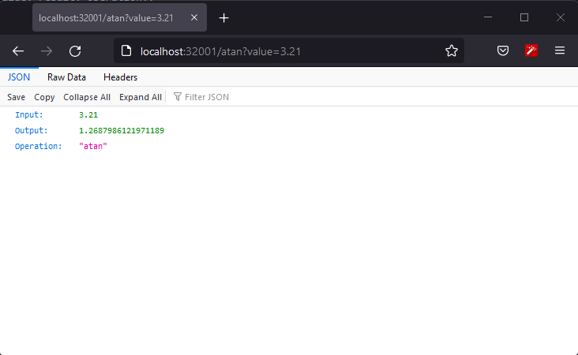
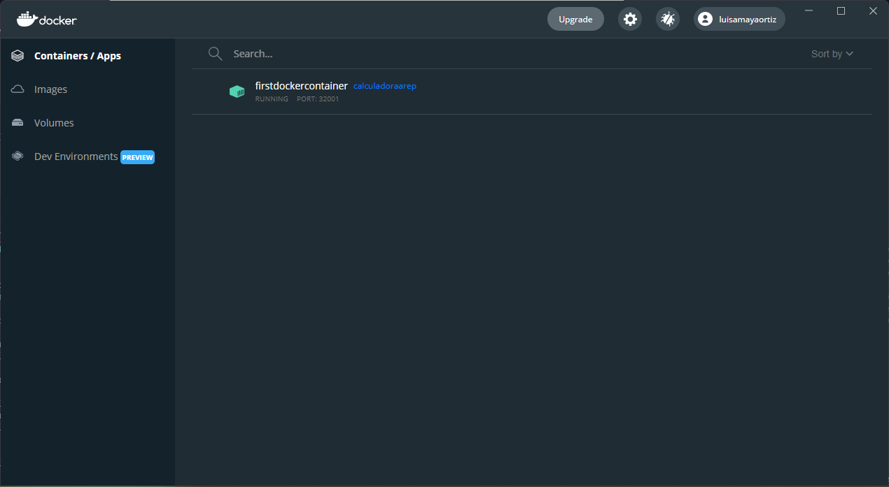

# AREP Parcial Practico 2
## Ejercicios de Diseño

## Descripción 🚀
En este proyecto se pide construir una aplicacion web, utilizando docker y que este desplegada en AWS. Donde se realiza una operacion matematica y que devuelva un json mostrando la operacion realizada, el valor ingresado y el resultado de esta.

Las imagenes que se ven a continuacion es del proyecto ejecutandose localmente.




Un video de como funciona dentro de AWS. [Video.mp4](img/Video.mp4)

### Pre-requisitos 📋

Para un optimo funcionamiento del proyecto en un ambiente de desarrollo se debe contar con los siguientes Apps instaladas y configuradas (en el caso de Java y Maven):

- [Java](https://www.java.com/es/download/ie_manual.jsp) : Lenguaje y entorno de desarrollo
- [Maven](https://maven.apache.org/) : Gestor de dependencias
- [Spark](https://sparkjava.com/download) : Micro-framework para desarrollo web
- [Git](https://git-scm.com/) : Software para control de versiones

## Instalación 🔧
1. Clonar el proyecto
    ````
    git clone https://github.com/luis-amaya/AREP-Parcial2.git
    ````
2. Compilarlo
    ````
    mvn clean install
    mvn package
    ````
3. Ejecucion del proyecto utilizando docker. Utilizando el Dockerfile
    ````
    docker build --tag dockercalculadora
    ````
4. A partir de esta imagen crear una instancia de un contenedor independiente de la consola y con el puerto 6000 enlazado a un puerto fisico de su máquina
   ````
   docker run -d -p 32001:6000 --name dockercalculadoracontainer dockercalculadora
   ````
5. Acceda desde su browser a 
    ````
        http://localhost:320001/
    ````
6. Para ejecutar cualquiera de las operaciones sin o atan
   ````
    http://localhost:320001/sin?value={valor a ingresar}
    http://localhost:320001/atan?value={valor a ingresar}
   ````

## Despliegue AWS

1. Acceda a su maquina virtual
2. Instale Docker en su instancia de EC2
   ````
   sudo yum update -p
   sudo yum install docker
   ````
3. inicie el servidor docker
   ````
   sudo service docker start
   ````
4. Configure su usuario en el grupo de docker para no tener que ingresar "sudo" cada vez que invoca un comando
   ````
   sudo usermod -a -G docker ec2-user
   ````
5. Desconectese y vuelvase a conectar para que el cambio tenga efecto
6. A partir de la imagen dentro de DockerHub, utilizando el comando que se utilizo localmente
   ````
   docker run -d -p 42000:6000 --name dockercalculadora luisamayaortiz/calculadoraarep
   ````
7. Abra los puertos de entrada del security group. En este caso el 42000
8. Verifique que pueda acceder en una url similar a esta (la url especifica de su maquina virtual EC2)
   ````
   http://ec2-35-175-205-168.compute-1.amazonaws.com:42000/sin?value={valor a ingresar}
   ````

## Construido con 🛠️
Proyecto construido con:

* [Spark](https://sparkjava.com/download) - El framework web usado
* [Maven](https://maven.apache.org/) - Manejador de dependencias

## Autores ✒️

***Luis Gerardo Amaya Ortiz***

## Licencia 📄

Este proyecto está bajo la Licencia (Tu Licencia) - mira el archivo [LICENSE](License.md) para detalles

Plantilla de README por: [Villanuevand](https://github.com/Villanuevand) 